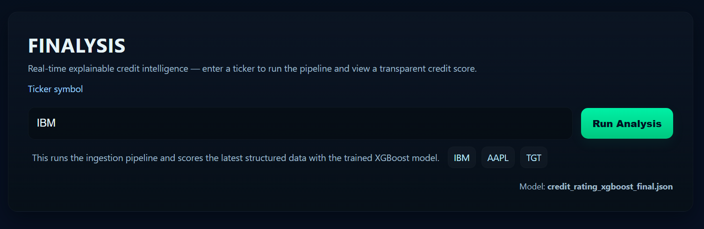
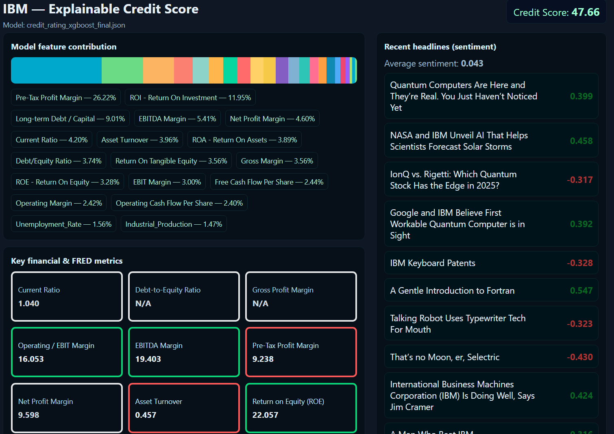

# Finalysis — Real-Time Explainable Credit Intelligence

A small Flask app that runs a pipeline to ingest multi-source financial & sentiment data, predicts an issuer credit score using a trained XGBoost model, and displays an explainable dashboard (stacked contribution bar, sentiment headlines, and key financial / FRED metrics).

Final UI screenshots:




---

## Quick start

1. Clone the repository (or pull it if you already have it):

```bash
git clone https://github.com/YohaanKhan/Finalysis.git
cd Finalysis
```

2. Create & activate a Python virtual environment:

**Windows (PowerShell)**

```powershell
python -m venv venv
.\venv\Scripts\Activate.ps1
```

**macOS / Linux**

```bash
python -m venv venv
source venv/bin/activate
```

3. Install dependencies:

```bash
pip install -r requirements.txt
```

4. Run the app from the project root (`Finalysis` folder):

```bash
python src/app.py
```

Open your browser at `http://127.0.0.1:5000/` and use the home page to enter a ticker (e.g. `IBM`) and run analysis.

---

## Recommended alternative run (package-style)

If you prefer package-style execution (avoids some import quirks):

```bash
cd Finalysis
python -m src.app
```

Both methods should work; `python src/app.py` is the documented quick command.

---

## Project layout (important files & folders)

```
Finalysis/
├─ data/
│  ├─ IBM_financials.csv
│  ├─ IBM_structured.csv
│  ├─ IBM_sentiment_data.json
│  └─ ...
├─ models/
│  ├─ credit_rating_xgboost_final.json
│  └─ credit_rating_xgboost_baseline.json
├─ src/
│  ├─ app.py
│  ├─ ingestion.py
│  ├─ sentiment.py
│  ├─ model_v1.py
│  └─ templates/
│     ├─ index.html
│     └─ dashboard.html
├─ requirements.txt
└─ README.md
```

## What the app does

* Accepts a ticker symbol on the homepage.
* Calls `run_pipeline(ticker)` (from `src/ingestion.py`) to collect/prepare data and create:

  * `data/{TICKER}_structured.csv`
  * `data/{TICKER}_sentiment_data.json`
* Loads the saved XGBoost model (`models/credit_rating_xgboost_final.json`) and predicts a credit score for the latest row in the structured CSV.
* Extracts model feature contribution (XGBoost gain importance) and normalizes it to percent.
* Renders a dashboard:

  * Single horizontal stacked bar: multi-colored segments representing contribution percentages (hover tooltip shows name + percent).
  * Sentiment headlines from `data/{TICKER}_sentiment_data.json`.
  * Key financial / FRED metrics — up to 22 metrics with bordered boxes (green for good, red for bad, white for medium/unknown) according to thresholds.

---

## Configuration / Environment

You will need FRED and NEWSAPI keys. Generate and load the keys in a .env file.

---

## Troubleshooting & common fixes

* **TemplateNotFound: index.html**
  Ensure `src/templates/index.html` and `src/templates/dashboard.html` exist and that you run `python src/app.py` from the project root (`Finalysis`), not from inside `src/`.

* **No module named 'src' / import problems**
  Run the app from the project root (Finalysis). If you see import errors, try `python -m src.app`. Alternatively, ensure `src/` is reachable on `sys.path` or convert `src` into a package (add `src/__init__.py`).

* **App hangs on startup because of downloads or top-level code**
  If `ingestion.py` / `sentiment.py` / `model_v1.py` run heavy code at import time (downloads, blocking input, long downloads), wrap such code inside:

  ```python
  if __name__ == "__main__":
      # run only when module executed directly
      ...
  ```

  so importing those modules from `app.py` does not execute their top-level behavior.

* **FileNotFound: data/{TICKER}\_financials.csv**
  The ingestion pipeline expects certain inputs or will produce outputs in `data/`. Make sure the `data/` folder contains the required files or that `run_pipeline` is configured to fetch/generate them. Also verify that `ingestion.py` uses `Path(__file__).resolve().parent.parent / "data"` style absolute pathing rather than relative `data/` strings.

* **XGBoost model load errors**
  Confirm `models/credit_rating_xgboost_final.json` exists and is a valid XGBoost model file. If missing, the app attempts to use the baseline file.

---

Codes and contributions by Yohaan Khan and Nideesh Kayal.
